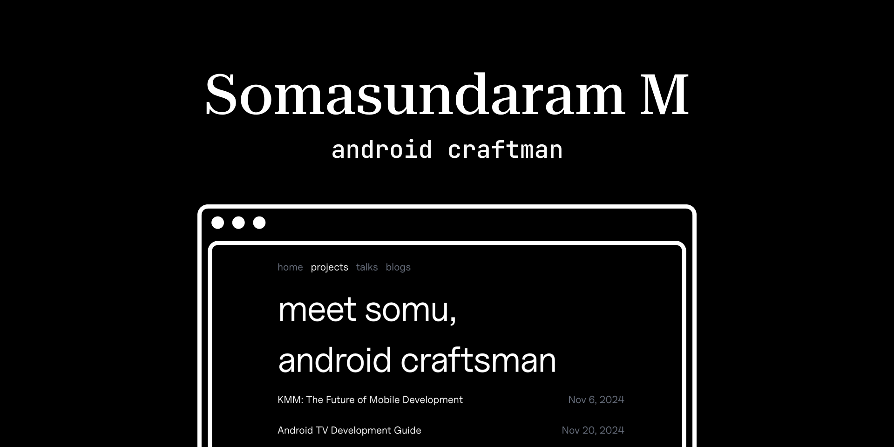

# 🚀 Android Craftsman
Hey! I'm Somasundaram Mahesh (msomu), a Senior Android Developer at Disney+ Hotstar crafting streaming experiences for millions of users.

## 🙏 Credits
This website is based on the template created by [Sanju](https://github.com/Spikeysanju). Check out his:
- Original Template: [sanju.sh repo](https://github.com/Spikeysanju/sanju.sh)
- Personal Website: [sanju.sh](https://sanju.sh)

## 💫 About Me
With 10+ years in mobile development, I specialize in building scalable streaming solutions, focusing on:
- Streaming and entertainment applications
- Cross-platform development with KMM
- Build automation and deployment
- Media playback optimization
- E-commerce solutions
- Ticketing systems

As a community leader at GDG Chennai, I regularly speak at events and organize gatherings to share knowledge and experiences.

## 📖 About Project
A personal website built with [Astro](https://astro.build/), featuring a dark theme that emphasizes readability and showcases my work in Android development, automation, and technical problem-solving.

## ✨ Features
- **Writings**: Technical deep-dives into Android development, KMM, and streaming technologies
- **Thoughts**: Insights from building at scale and community experiences

## 🛠️ Tech Stack
- **Astro**: Static site generator
- **TailwindCSS**: Utility-first CSS framework
- **Markdown**: Content formatting
- **TypeScript**: Type-safe development
- **Biome**: Code formatting and linting
- **Cloudflare Pages**: Hosting and deployment

## 🎨 Design
Dark theme optimized for readability, emphasizing technical content and professional experience.

## 🔧 Environment Variables
For analytics setup, add to your `.env` file:

```plaintext
# Umami Analytics
UMAMI_WEBSITE_ID=your_umami_website_id
UMAMI_TRACKING_URL=your_umami_tracking_url

# Clarity Analytics
CLARITY_TRACKING_ID=your_clarity_tracking_id
```

## 📬 Connect
- Email: msomasundaram93@gmail.com
- GDG Chennai
- LinkedIn
- Twitter

## 📜 License
Open source under the Apache License 2.0.