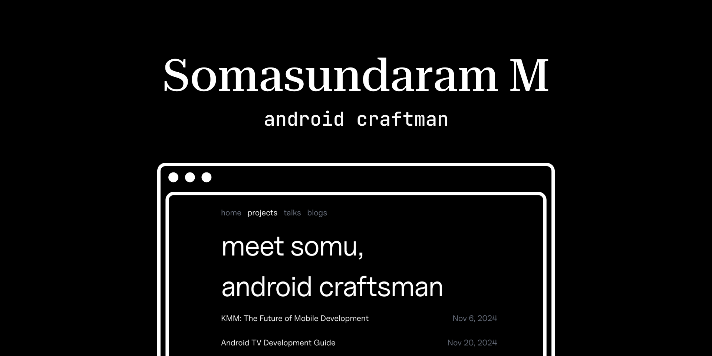

# 🚀 Android Craftsman
Hey! I'm Somasundaram Mahesh (msomu), a Senior Android Developer at JioHotstar crafting streaming experiences for millions of users.

## 🙏 Credits
This website is based on the template created by [Sanju](https://github.com/Spikeysanju). Check out his:
- Original Template: [sanju.sh repo](https://github.com/Spikeysanju/sanju.sh)
- Personal Website: [sanju.sh](https://sanju.sh)

## 💫 About Me
With 10+ years in mobile development, I specialize in building scalable streaming solutions, focusing on:
- Streaming and entertainment applications
- Cross-platform development with KMM
- Build automation and deployment
- Media playback optimization
- E-commerce solutions
- Ticketing systems

As a community leader at GDG Chennai, I regularly speak at events and organize gatherings to share knowledge and experiences.

## 📖 About Project
A personal website built with [Astro](https://astro.build/), featuring a dark theme that emphasizes readability and showcases my work in Android development, automation, and technical problem-solving.

## 📂 Project Structure
```
msomu.com/
├── public/             # Static assets (images, fonts, etc.)
├── src/                # Source code
│   ├── components/     # Reusable UI components
│   │   ├── cards/      # Card UI components
│   │   ├── cta/        # Call-to-action components
│   │   ├── misc/       # Miscellaneous components
│   │   └── seo/        # SEO-related components
│   ├── content/        # Content files (MDX, Markdown)
│   │   ├── motivation/ # Motivational content
│   │   ├── ship/       # Shipping/product release content
│   │   ├── thought/    # Thought pieces and reflections
│   │   ├── use/        # Tools and technologies used
│   │   ├── whoami/     # Personal information
│   │   └── writing/    # Articles and blog posts
│   ├── data/           # Data files and configurations
│   ├── layouts/        # Layout templates
│   ├── pages/          # Page components and routes
│   │   ├── ships/      # Ship-related pages
│   │   ├── thoughts/   # Thought-related pages
│   │   ├── uses/       # Use-related pages
│   │   └── writings/   # Writing-related pages
│   ├── styles/         # CSS and styling files
│   └── utils/          # Utility functions
├── astro.config.mjs    # Astro configuration
├── biome.json          # Biome (code formatting/linting) configuration
├── package.json        # Node.js package configuration
├── tailwind.config.mjs # Tailwind CSS configuration
└── tsconfig.json       # TypeScript configuration
```

## 🚀 Getting Started

### Prerequisites
- Node.js (v18 or later recommended)
- bun

### Installation
```bash
# Clone the repository
git clone https://github.com/yourusername/msomu.com.git
cd msomu.com

# Install dependencies
bun install
```

### Developmento
```bash
# Start development server
bun dev
```

### Building for Production
```bash
# Build the project
bun run build

# Preview the built project
bun run preview
```

### Code Quality
```bash
# Check code
bun run check

# Lint code
bun run lint

# Format code
bun run format
```

## ✨ Features
- **Writings**: Technical deep-dives into Android development, KMM, and streaming technologies
- **Thoughts**: Insights from building at scale and community experiences

## 🛠️ Tech Stack
- **Astro 7**: SSR site framework (`output: "server"`)
- **TailwindCSS 4**: Utility-first CSS framework via `@tailwindcss/vite`
- **Markdown/MDX**: Content formatting
- **TypeScript**: Type-safe development
- **Biome**: Code formatting and linting
- **Cloudflare Workers**: Hosting and deployment (`@astrojs/cloudflare` 14, `wrangler.jsonc`)

## 🎨 Design
Dark theme optimized for readability, emphasizing technical content and professional experience.

## 🔧 Environment Variables
For analytics setup, add to your `.env` file:

```plaintext
# Umami Analytics
UMAMI_WEBSITE_ID=your_umami_website_id
UMAMI_TRACKING_URL=your_umami_tracking_url

# Clarity Analytics
CLARITY_TRACKING_ID=your_clarity_tracking_id
```

## 📬 Connect
- Email: msomasundaram93@gmail.com
- GDG Chennai
- LinkedIn
- Twitter

## 📜 License
Open source under the Apache License 2.0.
